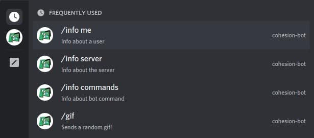
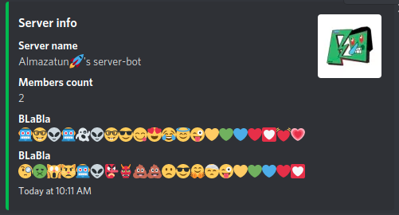

#Cohesion-bot 🤖

### Installation

```bash
# Clone the repository
git clone https://github.com/Almazatun/cohesion-bot-dts.git
# Enter into the directory
cd cohesion-bot-dts/
# Install the dependencies
npm install
```

### Starting the application

```bash
$ npm run build
# prod
$ npm run start
# development
$ npm run dev

```

### Starting the application using Docker

```bash
# Build the image
docker build -t cohesion-bot-dts .
# Run the image
docker run -d cohesion-bot-dts
# Logs the running docker container
docker logs -f <CONTAINER ID>
```

## Deploying commands

Slash commands in server



`/info server`



`/info commands`


## Features & Commands

`>wrd cohesion [you can use any word]`


`>react [1, 2, 3]` 
