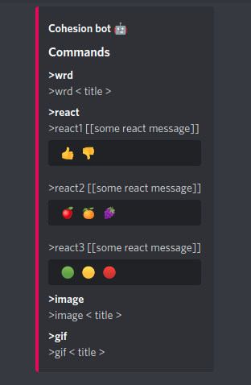
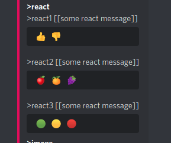

# Cohesion-bot 🤖

### Notes

In order to run the application make the following steps:

* Create an App in Discord
  https://discord.com/developers/applications

* Copy from your created application part confirm info:
    * APPLICATION ID ---> CLIENT_ID
    * APPLICATION TOKEN ---> DISCORD_TOKEN
    * GUILD_ID
    * TENOR_APIKEY

### Installation

```bash
# Clone the repository
git clone https://github.com/Almazatun/cohesion-bot-dts.git
# Enter into the directory
cd cohesion-bot-dts/
# Install the dependencies
npm install
```

### Starting the application

```bash
$ npm run build
# prod
$ npm run start
# development
$ npm run dev

```

### Starting the application using Docker

```bash
# Build the image
$ docker build -t cohesion-bot-dts .
# Run the image
$ docker run -d cohesion-bot-dts
# Logs the running docker container
$ docker logs -f <CONTAINER ID>
```

## Deploying commands

Slash commands in server


`/info server`


`/info commands`



`/news vc`


## Features & Commands

* `>wrd cohesion [you can use any word]`


* `>react [1, 2, 3]` 



* `>gif <title>` 


* `>image <title>`  
